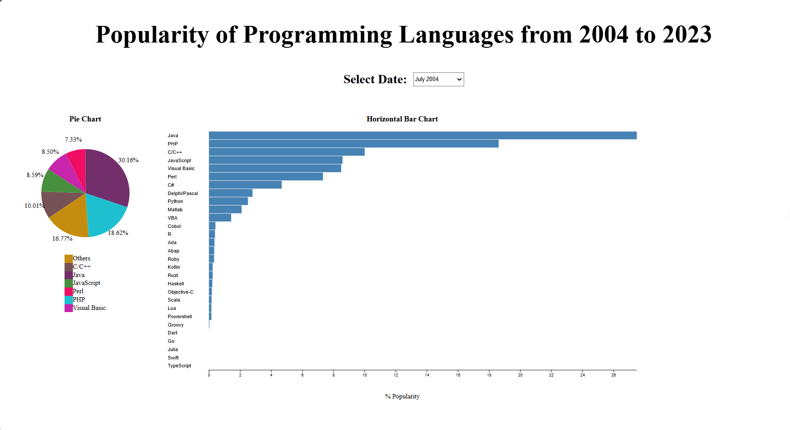

# Data Science and Data Visualization Project

# Popularity of Programming Languages from 2004 to 2023

## About The Project
- The Final Project for the IU' 2024 Data Science and Data Visualization course.

- The analysis of the popularity of programming languages from 2004 to 2023 employs data science and visualization to understand and represent trends in programming language usage. Through advanced analytics, it reveals shifts in language popularity, while data visualization transforms complex insights into accessible formats. This synergy informs decision-making for developers, educators, and businesses, fostering a collective understanding of the evolving landscape of programming languages.

## 

## My Team
### Group GODs
| Student's ID |        Full Name       |
|--------------|------------------------|
| ITDSIU21109  |      Trần Bảo Phúc     |
| ITDSIU21119  |      Ngô Hoàng Thành   |
| ITDSIU21118  |      Lê Xuân Tâm       |
| ITDSIU21014  |      Nguyễn Bá Duy     |
| ITDSIU21002  |      Nguyễn Hữu Khang  |

## Getting Started

### Prerequisites

* Windows 10 or 11
* ***For development:***
    * [IDE: Visual Studio Code](https://code.visualstudio.com/download)
    * [JavaScript](https://download.com.vn/javascript)
    * [HTML](https://download.com.vn/s/html)
    * [Live Server](https://chrome.google.com/webstore/detail/live-server-web-extension/fiegdmejfepffgpnejdinekhfieaogmj?hl=vi)
    * [Git](https://git-scm.com/downloads)
  
### Installation
* Clone the repo

## Usage
* Open folder DSDV Project
* Select *index.html* file then Run this file with Live Server

### To Use

1. Open folder DSDV PROJECT
2. Continue click on index.html file
3. Run this file with Live Server

## Contact

Tran Bao Phuc : [Facebook](https://www.facebook.com/baophuclyk18.cla/) 
- Gmail: baophuc.itds.hcmiu@gmail.com
- Edu: ITDSIU21109@student.hcmiu.edu.vn 

## Project Report: [Report](https://docs.google.com/document/d/1dApGSHpfpSaWh7FcWbHLxrag7qXdoh57D3DkF-eJD9Q/edit?usp=sharing)

(<a href="#readme-top">back to top</a>)

